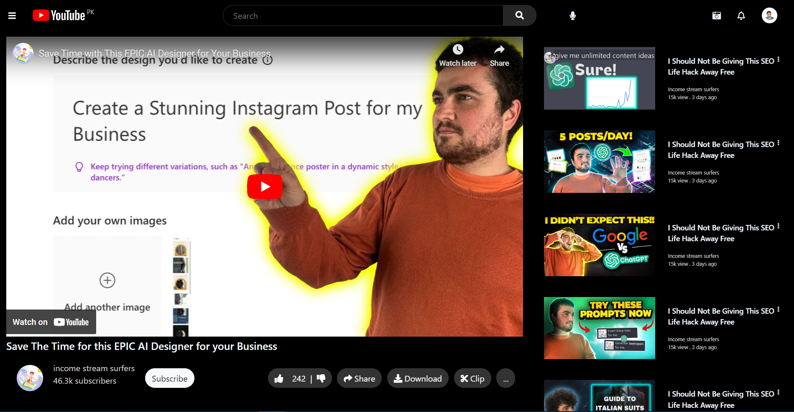

<h1>Youtue Clone</h1>

This a Youtube Clone developed using Html, CSS, JS and Bootstarp
Is originally created for learningp purposes. 

This is not an Exact Match, but you would surely like it.
I have created just a channel page of the youtuber that is helping me getting progerss now a days. 

<figure>
 
<figcaption>Youtube Channel Page Showing some vedios</figcaption>
</figure>
<figure>
 
<figcaption>Youtube player Page Showing more vdios of the Same Channel</figcaption>
</figure>